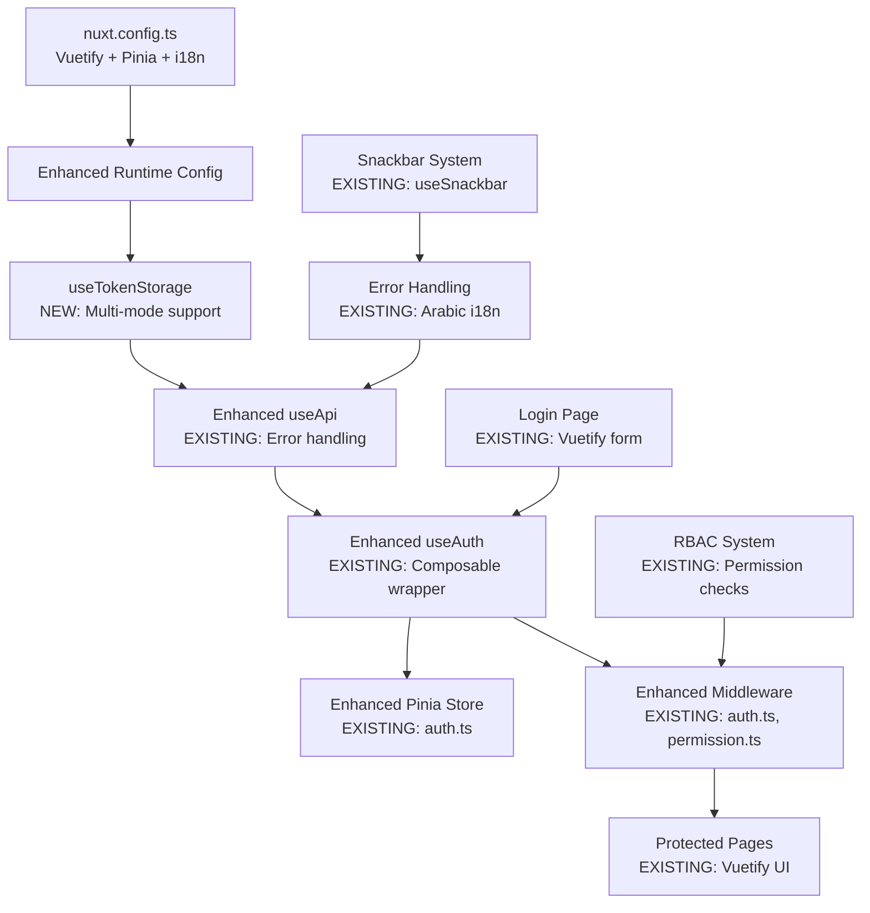
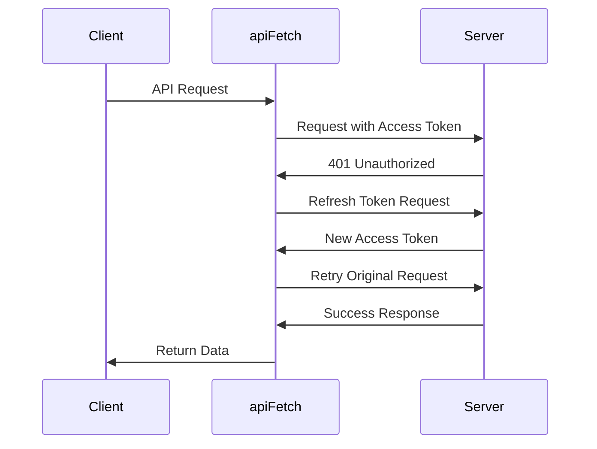

# Design Document

## Overview

This design enhances the existing Nuxt 4 authentication system to support multiple token management strategies while maintaining compatibility with the current Vuetify + Pinia + i18n architecture. The enhanced system will provide flexible authentication modes (access-only, refresh, cookie) while preserving all existing functionality and improving security best practices.

## Architecture

### Core Principles

1. **Strategy Pattern**: Authentication modes (access-only, refresh, cookie) are interchangeable through configuration
2. **Composable-First**: All functionality is built as reusable composables, with Pinia as an optional layer
3. **Type Safety**: Full TypeScript coverage with runtime validation where needed
4. **SSR Compatibility**: Proper handling of server/client boundaries and state hydration

### Current Architecture Integration



## Components and Interfaces

### 1. Enhanced Configuration Layer

**File**: `nuxt.config.ts` (Enhanced)

- Add runtime configuration for auth modes while preserving existing Vuetify/i18n setup
- Maintain current module configuration (Pinia, Vuetify, i18n)
- Add new auth mode configuration options

**File**: `shared/types/auth.ts` (New - extends existing types)

```typescript
// Extend existing shared/types/index.ts
export type AuthMode = "access" | "refresh" | "cookie";

// Enhanced User interface (compatible with existing)
export interface User {
  id: number;
  name: string;
  username: string;
  email: string;
  permissions: string[];
  roles: string[];
  group?: any;
  // New optional fields for enhanced functionality
  avatar?: string;
  lastLoginAt?: string;
  createdAt?: string;
}

// New token management interfaces
export interface AuthTokens {
  accessToken: string;
  refreshToken?: string;
  expiresIn?: number;
  tokenType?: string;
}

// Enhanced AuthState (compatible with existing store)
export interface AuthState {
  token: string | null;
  user: User | null;
  loading: boolean;
  error: string | null;
  isInitialized: boolean;
  // New fields for enhanced functionality
  authMode?: AuthMode;
  tokenExpiresAt?: number;
}

// New configuration interface
export interface AuthConfig {
  mode: AuthMode;
  refreshThreshold: number; // minutes before expiry to refresh
  maxRetries: number;
  sessionTimeout: number; // minutes of inactivity before logout
}
```

### 2. Enhanced Token Management Layer

**File**: `composables/useTokenStorage.ts` (New)

- Abstracts token storage based on auth mode configuration
- Integrates with existing localStorage usage in auth store
- Provides backward compatibility with current token handling
- Supports three modes: access-only, refresh, and cookie-based
- Maintains security best practices for token storage

**Key Methods**:

- `getAccessToken()`: Returns current access token (always from memory)
- `setAccessToken(token)`: Stores access token in memory only (no persistence)
- `getRefreshToken()`: Returns refresh token from localStorage (refresh mode only)
- `setRefreshToken(token)`: Stores refresh token in localStorage (refresh mode only)
- `clear()`: Clears all stored tokens (memory + localStorage)
- `getAuthMode()`: Returns current authentication mode
- `isTokenExpired()`: Checks token expiration status

**Storage Strategy** (No PERSIST_TOKENS option):

- **Access Mode**: Access tokens in memory only (lost on refresh)
- **Refresh Mode**: Access tokens in memory, refresh tokens in localStorage
- **Cookie Mode**: No client-side token storage (httpOnly cookies only)

### 3. Enhanced API Layer

**File**: `composables/useApi.ts` (Enhanced - existing file)

- Enhance existing useApi composable with multi-mode token management
- **NEW**: Add public API methods that don't require authentication
- **NEW**: Comprehensive error handling with intelligent fallback messages
- **NEW**: Network connectivity monitoring and user notifications
- Preserve existing error handling and Arabic i18n integration
- Add automatic token refresh flow for refresh mode
- Maintain compatibility with existing API calls throughout the app
- Integrate with existing snackbar system for user feedback

**Enhanced Flow**:

1. **NEW**: Detect public vs authenticated endpoints automatically
2. Use existing getAuthHeaders() with mode-aware token attachment (auth endpoints only)
3. Preserve existing API request methods (get, post, put, patch, delete)
4. **NEW**: Add publicGet, publicPost methods for unauthenticated requests
5. Enhance 401 error handling with automatic refresh (refresh mode only)
6. **NEW**: Add comprehensive error categorization (network, server, validation, unknown)
7. **NEW**: Network status monitoring with Arabic success/failure notifications
8. Maintain existing error handling for other status codes
9. Integrate with existing handleApiError function
10. Preserve existing Arabic error messages and snackbar integration
11. **NEW**: Ensure backend error messages take priority over client-side messages
12. **NEW**: Global 401 handler with intelligent route-based behavior:
    - Show session expired message for protected routes
    - Skip 401 handling for public routes (login, register)
    - Auto-save return URL for seamless user experience
    - Clear all authentication data on session expiry
    - Integrate with existing Arabic snackbar system

### 4. Enhanced Authentication Layer

**File**: `composables/useAuth.ts` (Enhanced - existing file)

- Enhance existing composable to work with new token management
- Preserve existing permission checking functions (hasPermission, hasRole, etc.)
- Maintain compatibility with existing components using useAuth
- Add new mode-aware authentication methods
- Keep existing canAccess functionality for RBAC

**File**: `stores/auth.ts` (Enhanced - existing file)

- Enhance existing Pinia store with multi-mode token support
- Preserve all existing getters (isAuthenticated, hasPermission, hasRole, etc.)
- Enhance existing actions (login, logout, refreshUser, etc.) with new token modes
- Maintain backward compatibility with existing store usage
- Add new mode-aware token management while preserving localStorage integration

**Enhanced Methods** (preserving existing API):

- `login(username, password)`: Enhanced with mode-aware token handling
- `logout()`: Enhanced with proper token cleanup for all modes
- `refreshUser()`: Enhanced with automatic token refresh
- `validateToken()`: Enhanced with mode-specific validation
- All existing permission methods remain unchanged

### 5. Enhanced Authorization Layer (Preserving Existing)

**File**: `composables/useRBAC.ts` (New - optional enhancement)

- Optional composable that wraps existing auth store RBAC functionality
- Provides alternative API while maintaining compatibility with existing permission system
- Integrates with existing hasPermission, hasRole methods from auth store

**File**: `middleware/auth.ts` (Enhanced - existing file)

- **Zero Flash Protection**: Immediate redirect with no protected content shown
- **Home Page Protection**: Root route ('/') requires authentication
- **SSR-Safe Redirects**: Proper server-side authentication checking
- Enhance existing auth middleware with mode-aware token validation
- Preserve existing redirect logic and unauthorized page handling
- Maintain existing auth initialization and validation flow
- Add support for automatic token refresh in refresh mode

**File**: `middleware/permission.ts` (Enhanced - existing file)

- Preserve existing permission checking logic and Arabic error messages
- Maintain existing page meta integration (permission, permissions, permissionMode)
- Keep existing getPermissionDisplayName function with Arabic translations
- Enhance with better error handling for different auth modes

**File**: `middleware/guest.ts` (Enhanced - existing file)

- Preserve existing guest middleware functionality
- Enhance with mode-aware authentication checking
- Maintain existing redirect URL handling

## Enhanced Data Models (Backward Compatible)

### Enhanced User Model (extends existing)

```typescript
// Compatible with existing auth store User interface
interface User {
  id: number;
  name: string;
  username: string;
  email: string;
  permissions: string[];
  roles: string[];
  group?: any;
  // New optional fields for enhanced functionality
  avatar?: string;
  lastLoginAt?: string;
  createdAt?: string;
  tokenExpiresAt?: number;
}
```

### Token Management Models

```typescript
interface AuthTokens {
  accessToken: string;
  refreshToken?: string;
  expiresIn?: number;
  tokenType?: string;
}

interface RefreshResponse {
  accessToken: string;
  refreshToken?: string;
  expiresIn: number;
  user?: User; // Optional user data update
}

interface TokenValidationResponse {
  valid: boolean;
  expiresAt?: number;
  user?: User;
}
```

### API Response Models (extends existing ApiResponse)

```typescript
// Extends existing shared/types/index.ts ApiResponse
interface LoginResponse
  extends ApiResponse<{
    token: string;
    user: User;
    refreshToken?: string;
    expiresIn?: number;
  }> {
  message?: string;
}

interface AuthError {
  statusCode: number;
  statusMessage: string;
  data?: {
    message: string;
    requiredPermission?: string;
    requiredPermissions?: string[];
    userPermissions?: string[];
  };
}
```

## Error Handling

### Authentication Errors

1. **401 Unauthorized**: Trigger token refresh or redirect to login
2. **403 Forbidden**: Redirect to unauthorized page
3. **Network Errors**: Show user-friendly error messages
4. **Validation Errors**: Display field-specific errors

### Token Refresh Flow



### Error Recovery Strategies

- **Automatic Retry**: For network timeouts and temporary failures
- **Token Refresh**: For expired access tokens (refresh mode only)
- **Graceful Degradation**: Fallback to login for unrecoverable errors
- **User Feedback**: Clear error messages in Arabic/English

## Testing Strategy

### Unit Tests

- Token storage operations across different modes
- Authentication composable methods
- RBAC permission checking logic
- API wrapper error handling

### Integration Tests

- Complete login/logout flows
- Token refresh scenarios
- Route protection middleware
- SSR state hydration

### E2E Tests

- User authentication journeys
- Role-based access scenarios
- Multi-tab synchronization
- Token expiration handling

### Test Structure

```
tests/
├── unit/
│   ├── composables/
│   │   ├── useAuth.test.ts
│   │   ├── useTokenStorage.test.ts
│   │   └── useRBAC.test.ts
│   └── stores/
│       └── auth.test.ts
├── integration/
│   ├── auth-flow.test.ts
│   └── middleware.test.ts
└── e2e/
    ├── login-logout.spec.ts
    └── protected-routes.spec.ts
```

## Enhanced Error Handling and Network Management

### Comprehensive Error Handling Strategy

```typescript
interface ErrorCategory {
  type: "network" | "server" | "validation" | "auth" | "permission" | "unknown";
  message: string;
  shouldShowToUser: boolean;
  shouldLog: boolean;
}

interface NetworkStatus {
  isOnline: boolean;
  lastOnlineAt?: Date;
  connectionType?: string;
}
```

### Error Handling Hierarchy

1. **Backend Error Messages**: Always prioritize server-provided error messages
2. **Network Errors**: Show connectivity status with Arabic notifications
3. **Authentication Errors (401)**:
   - **Global Handler**: Show "انتهت صلاحية الجلسة، يرجى التسجيل مجدداً"
   - **Auto-redirect**: Redirect to login page after showing message
   - **Session cleanup**: Clear all auth data automatically
   - **Return URL**: Save current page for redirect after re-login
4. **Permission Errors (403)**: Handle with appropriate Arabic messages
5. **Validation Errors**: Display field-specific errors from backend
6. **Unknown Errors**: Fallback to generic "حدث خطأ ما" message
7. **Success Recovery**: Green notification when connection is restored

### Network Monitoring Integration

- **Real-time monitoring**: Using `navigator.onLine` and network events
- **Arabic notifications**: "انقطع الاتصال بالإنترنت" / "تم استعادة الاتصال"
- **Auto-retry logic**: Intelligent retry for failed requests when connection restored
- **Non-intrusive UI**: Snackbar notifications that don't interfere with backend messages

### Public Endpoint Support

```typescript
interface ApiEndpointConfig {
  requiresAuth: boolean;
  isPublic: boolean;
  retryOnNetworkError: boolean;
  showNetworkErrors: boolean;
  handle401: boolean; // Whether to show session expired message
}

// Public endpoints configuration (no auth required)
const PUBLIC_ENDPOINTS = [
  "/auth/login", // Login page - public access
  "/auth/register", // Signup page - public access
  "/auth/forgot-password",
  "/public/*", // Any public API endpoints
  "/health", // Health check
  "/version", // Version info
  "/contact", // Contact forms
  "/newsletter", // Newsletter subscription
];

// Routes that should not trigger 401 session expired messages
const NO_401_HANDLING_ROUTES = [
  "/login",
  "/register",
  "/forgot-password",
  "/reset-password",
];
```

### Global 401 Session Expiry Handler

```typescript
interface SessionExpiredConfig {
  message: string; // Arabic message to show
  redirectDelay: number; // Delay before redirect (ms)
  saveReturnUrl: boolean; // Save current page for return
  clearAuthData: boolean; // Clear all auth data
  showSnackbar: boolean; // Show snackbar notification
}

// Default configuration for session expiry
const SESSION_EXPIRED_CONFIG: SessionExpiredConfig = {
  message: "انتهت صلاحية الجلسة، يرجى التسجيل مجدداً",
  redirectDelay: 2000, // 2 seconds delay
  saveReturnUrl: true, // Save current page
  clearAuthData: true, // Clear all auth data
  showSnackbar: true, // Show notification
};
```

### Public Endpoint Support

```typescript
interface ApiEndpointConfig {
  requiresAuth: boolean;
  isPublic: boolean;
  retryOnNetworkError: boolean;
  showNetworkErrors: boolean;
}

// Public endpoints configuration
const PUBLIC_ENDPOINTS = [
  "/auth/login",
  "/auth/register",
  "/public/*",
  "/health",
  "/version",
];
```

## Enhanced Security Considerations

### Token Storage Security (Mode-Aware)

- **Access Mode**: Access tokens in memory only (no persistence - user must re-login on refresh)
- **Refresh Mode**: Access tokens in memory, refresh tokens in localStorage only
- **Cookie Mode**: All tokens managed by httpOnly cookies (most secure)
- **No Persistence Option**: Access tokens are NEVER persisted to localStorage for security
- **Backward Compatibility**: Existing localStorage usage for refresh tokens only

### XSS Protection (Enhanced)

- Configurable token storage based on environment (development vs production)
- Maintain existing input sanitization in Vuetify components
- Integrate with existing CSP headers configuration
- Add token encryption option for localStorage storage

### CSRF Protection (Integrated)

- Leverage existing Nuxt 4 CSRF protection
- SameSite cookie attributes for cookie mode
- Integrate with existing API error handling
- Maintain existing CORS configuration

### Session Management (Enhanced)

- Automatic logout on token expiration (all modes)
- Multi-tab synchronization using existing localStorage events
- Integrate with existing snackbar system for session notifications
- Preserve existing Arabic session expiry messages

## Performance Optimizations

### Lazy Loading

- Authentication composables loaded on demand
- User data fetched only when needed
- Route-level code splitting for auth pages

### Caching Strategy

- User data cached in memory during session
- Token validation cached with TTL
- API response caching for static user data

### SSR Optimization

- Minimal server-side auth checks
- Client-side hydration for dynamic auth state
- Proper handling of auth redirects in SSR

## Integration with Existing Architecture

### Enhanced Vuetify Integration

- Preserve existing Vuetify theming and component usage
- Maintain existing login form design and validation
- Keep existing Arabic RTL support and styling
- Integrate new auth modes with existing Vuetify snackbar system
- Preserve existing responsive design and animations
- **NEW**: Professional unauthorized page using Vuetify 3 components only
- **NEW**: All new pages designed exclusively with Vuetify 3 components and styles
- **Design Standards**: Clean, simple, professional UI following Vuetify 3 design principles

### Professional Unauthorized Page Design

```vue
<!-- Using Vuetify 3 components exclusively -->
<template>
  <v-container class="fill-height" fluid>
    <v-row align="center" justify="center">
      <v-col cols="12" sm="8" md="6" lg="4">
        <v-card class="elevation-12" rounded="lg">
          <v-card-item class="text-center pa-8">
            <v-avatar size="80" color="warning" class="mb-4">
              <v-icon size="40" color="white">mdi-shield-lock-outline</v-icon>
            </v-avatar>
            <v-card-title class="text-h5 mb-2">
              {{ $t("auth.unauthorized.title") }}
            </v-card-title>
            <v-card-subtitle class="text-body-1">
              {{ $t("auth.unauthorized.message") }}
            </v-card-subtitle>
          </v-card-item>
          <v-card-actions class="pa-6">
            <v-btn
              color="primary"
              variant="elevated"
              block
              size="large"
              @click="goToLogin"
            >
              {{ $t("auth.login.title") }}
            </v-btn>
          </v-card-actions>
        </v-card>
      </v-col>
    </v-row>
  </v-container>
</template>
```

### Pinia Store Enhancement Strategy

- Extend existing `stores/auth.ts` without breaking changes
- Add new getters and actions while preserving existing ones
- Maintain existing state structure with optional new fields
- Preserve existing localStorage integration patterns
- Add new token management while keeping backward compatibility

### Enhanced i18n Integration

- Maintain existing Arabic/English language support
- Preserve existing error message translations
- Add new auth mode related translations to existing locale files
- **NEW**: Add network status messages to locale files:
  ```json
  // app/i18n/locales/ar.json
  {
    "network": {
      "offline": "انقطع الاتصال بالإنترنت",
      "online": "تم استعادة الاتصال بالإنترنت",
      "reconnecting": "جاري إعادة الاتصال...",
      "error": "خطأ في الشبكة، يرجى المحاولة لاحقاً"
    },
    "errors": {
      "unknown": "حدث خطأ ما، يرجى المحاولة مرة أخرى",
      "server": "خطأ في الخادم، يرجى المحاولة لاحقاً",
      "validation": "يرجى التحقق من البيانات المدخلة"
    },
    "auth": {
      "unauthorized": {
        "title": "غير مصرح لك بالدخول",
        "message": "يجب تسجيل الدخول للوصول إلى هذه الصفحة"
      },
      "sessionExpired": "انتهت صلاحية الجلسة، يرجى التسجيل مجدداً"
    }
  }
  ```
- Keep existing RTL/LTR direction handling
- Integrate new features with existing `useI18n` usage
- **NEW**: Ensure backend error messages override i18n fallbacks

### Middleware Enhancement Strategy

- Enhance existing middleware files without breaking current functionality
- Preserve existing route protection logic
- Maintain existing permission checking and Arabic error messages
- Add new token validation while keeping existing redirect patterns
- Keep existing unauthorized page handling

### Enhanced API Integration

- Enhance existing `useApi` composable with new token management
- **NEW**: Add support for public endpoints without authentication headers
- **NEW**: Comprehensive error handling for all error types with fallback messages
- **NEW**: Network connectivity monitoring with Arabic notifications
- Preserve existing error handling and snackbar integration
- Maintain existing Arabic error messages and user feedback
- Add new refresh token flow while keeping existing API patterns
- Keep existing request/response handling and loading states
- Ensure no conflicts between client-side notifications and backend responses

## Enhanced Development Workflow

### Mode Switching (Environment-Based)

Add to existing `.env` file or create new environment variables:

```bash
# Access token only (development/testing)
# Access tokens stored in memory only - no persistence
NUXT_PUBLIC_AUTH_MODE=access

# Access + Refresh tokens (recommended for production)
# Access tokens in memory, refresh tokens in localStorage only
NUXT_PUBLIC_AUTH_MODE=refresh

# Cookie-based auth (most secure for production)
# All tokens managed by httpOnly cookies
NUXT_PUBLIC_AUTH_MODE=cookie
```

### Implementation Compatibility

Existing code continues to work without changes:

```typescript
// Existing usage (unchanged)
const authStore = useAuthStore();
const { isAuthenticated, hasPermission } = useAuth();

// New enhanced usage (optional)
const { getAuthMode, isTokenExpired } = useTokenStorage();
```

### New Composables for Enhanced Functionality

**File**: `composables/useNetworkStatus.ts` (Enhanced - existing file)

- Enhance existing network status monitoring
- Add Arabic notifications for connection changes
- Integrate with existing snackbar system
- Provide connection recovery notifications
- Monitor network quality and connection type

**File**: `composables/useErrorHandler.ts` (Enhanced - existing file)

- Enhance existing error handling utilities
- Add comprehensive error categorization
- Prioritize backend error messages over client-side messages
- Provide intelligent fallback error messages in Arabic
- Integrate with existing error handling patterns

**File**: `composables/usePublicApi.ts` (New)

- Dedicated composable for public API endpoints
- No authentication headers or token management
- Simplified error handling for public endpoints
- Integration with network status monitoring
- Support for guest/anonymous operations

### Immediate Route Protection Strategy

**Zero Flash Policy Implementation**:

```typescript
// SSR-safe immediate protection
export default defineNuxtRouteMiddleware((to) => {
  // Server-side: Always redirect unauthenticated users
  if (process.server) {
    // Check for public routes first
    if (isPublicRoute(to.path)) return;

    // For protected routes, redirect immediately
    return navigateTo("/unauthorized");
  }

  // Client-side: Immediate check without waiting
  const authStore = useAuthStore();

  // Initialize auth synchronously if possible
  if (!authStore.isInitialized) {
    authStore.initAuth();
  }

  // Immediate redirect for unauthenticated users
  if (!authStore.isAuthenticated && !isPublicRoute(to.path)) {
    return navigateTo("/unauthorized");
  }
});
```

**Home Page Protection**:

- Root route ('/') requires authentication
- Immediate redirect to unauthorized page if not logged in
- No dashboard content flash even for milliseconds
- Seamless redirect to dashboard after successful login

**Public Routes Configuration**:

```typescript
const PUBLIC_ROUTES = [
  "/login",
  "/register",
  "/unauthorized",
  "/forgot-password",
  "/reset-password",
];

const isPublicRoute = (path: string): boolean => {
  return PUBLIC_ROUTES.some(
    (route) => path === route || path.startsWith(route + "/")
  );
};
```

### Code Quality and Documentation Standards

**Comprehensive Code Comments**: Every file will include:

```typescript
/**
 * Enhanced Authentication System for Nuxt 4
 *
 * This file handles [specific functionality]
 *
 * Features:
 * - Multi-mode token management (access/refresh/cookie)
 * - Global 401 session expiry handling
 * - Network status monitoring
 * - Public endpoint support
 * - Arabic i18n integration
 *
 * @author Your Team
 * @version 2.0.0
 * @since 2025-01-01
 */

// Clear section comments for each major function
// Inline comments explaining complex logic
// JSDoc comments for all public methods
// Type annotations with explanatory comments
```

**Clean Architecture Principles**:

- **Single Responsibility**: Each composable handles one specific concern
- **Clear Naming**: Function and variable names explain their purpose
- **Consistent Patterns**: Same patterns used across all auth-related files
- **Error Boundaries**: Clear error handling at each layer
- **Type Safety**: Full TypeScript coverage with meaningful type names

**Professional Standards**:

- **No Magic Numbers**: All timeouts and delays as named constants
- **Configuration-Driven**: All behavior configurable via environment variables
- **Testable Code**: All functions designed for easy unit testing
- **Performance Optimized**: Minimal re-renders and efficient state management
- **Security First**: All security considerations documented and implemented

### Integration with Existing Tools

- Maintain existing TypeScript configuration and strict mode
- Preserve existing ESLint configuration with additional auth-specific rules
- Integrate with existing Vuetify development tools
- Maintain existing i18n development workflow
- **NEW**: Add network status and error handling testing utilities
- Add new auth mode testing utilities with comprehensive test coverage
- Preserve existing hot module replacement for Vuetify components
- **NEW**: Add development tools for testing different network conditions
- **NEW**: Add comprehensive JSDoc documentation for all public APIs
