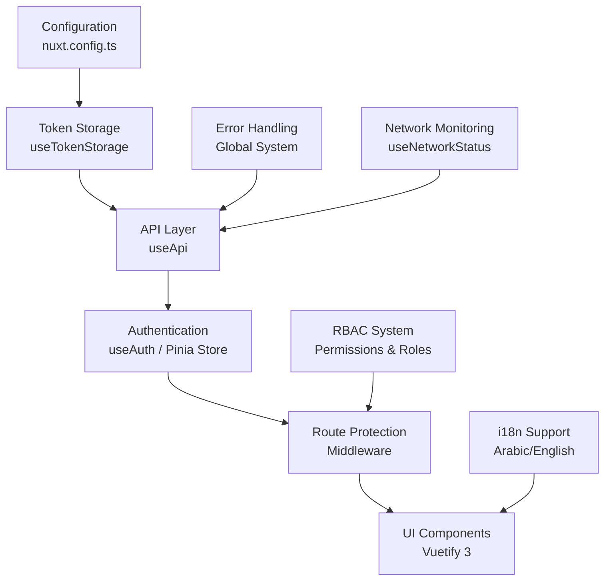

# Enhanced Nuxt 4 Authentication System Documentation

## 📚 Complete Documentation Index

Welcome to the comprehensive documentation for the Enhanced Nuxt 4 Authentication System. This system provides robust, flexible, and secure authentication with multi-mode token management, professional UI components, and full Arabic/English internationalization support.

## 🚀 Getting Started

### Main Guides

| Guide                                                           | Description                                  | Best For                        |
| --------------------------------------------------------------- | -------------------------------------------- | ------------------------------- |
| **[Main Authentication Guide](./main-authentication-guide.md)** | Complete system overview and architecture    | Understanding the entire system |
| **[Migration & Upgrade Guide](./migration-upgrade-guide.md)**   | Zero-downtime migration from existing system | Upgrading existing applications |

### Quick Start Guides (5-Minute Setup)

| Feature                 | Guide                                                              | Description                               |
| ----------------------- | ------------------------------------------------------------------ | ----------------------------------------- |
| 🔐 **Token Management** | [Quick Start: Token Management](./quick-start-token-management.md) | Multi-mode token storage and security     |
| 👥 **RBAC**             | [Quick Start: RBAC](./quick-start-rbac.md)                         | Role-based access control and permissions |
| 🌐 **API Integration**  | [Quick Start: API Integration](./quick-start-api-integration.md)   | Enhanced API calls with error handling    |
| 🎨 **UI Components**    | [Quick Start: UI Components](./quick-start-ui-components.md)       | Professional Vuetify 3 components         |

## 📖 Detailed Feature Guides

### Core System Components

| Component          | Guide                                                                   | Key Features                                                                             |
| ------------------ | ----------------------------------------------------------------------- | ---------------------------------------------------------------------------------------- |
| **Token Storage**  | [Token Storage Guide](./token-storage-guide.md)                         | • 3 security modes<br>• Memory-only access tokens<br>• Automatic expiry handling         |
| **Authentication** | [Authentication Approaches Guide](./authentication-approaches-guide.md) | • Pinia store approach<br>• Composable-only approach<br>• Migration between approaches   |
| **API Layer**      | [API Usage Guide](./api-usage-guide.md)                                 | • Public vs authenticated endpoints<br>• Automatic token refresh<br>• Network monitoring |
| **RBAC System**    | [RBAC Guide](./rbac-guide.md)                                           | • Role-based access control<br>• Permission checking<br>• Route protection               |

### User Experience & Interface

| Feature                  | Guide                                             | Key Features                                                                          |
| ------------------------ | ------------------------------------------------- | ------------------------------------------------------------------------------------- |
| **UI Components**        | [UI Components Guide](./ui-components-guide.md)   | • Professional Vuetify 3 design<br>• RTL/LTR support<br>• Responsive layouts          |
| **Error Handling**       | [Error Handling Guide](./error-handling-guide.md) | • Global error management<br>• Arabic/English messages<br>• Network status monitoring |
| **Internationalization** | [i18n Auth Guide](./i18n-auth-guide.md)           | • Arabic/English support<br>• RTL layout handling<br>• Dynamic language switching     |

## 🎯 Choose Your Path

### For New Projects

1. Start with [Main Authentication Guide](./main-authentication-guide.md)
2. Follow [Quick Start: Token Management](./quick-start-token-management.md)
3. Add features with other Quick Start guides

### For Existing Projects

1. Read [Migration & Upgrade Guide](./migration-upgrade-guide.md)
2. Test backward compatibility
3. Gradually adopt new features

### For Specific Features

Jump directly to the relevant guide:

- Need RBAC? → [RBAC Guide](./rbac-guide.md)
- Want better UI? → [UI Components Guide](./ui-components-guide.md)
- API issues? → [API Usage Guide](./api-usage-guide.md)

## 🔧 System Architecture



## 🛡️ Security Features

### Token Management

- **Access Mode**: Highest security (memory-only tokens)
- **Refresh Mode**: Balanced security/UX (recommended)
- **Cookie Mode**: Enterprise security (httpOnly cookies)

### Protection Mechanisms

- XSS protection through memory-only access tokens
- Automatic session expiry handling
- Global 401 error management
- Input validation and sanitization

### Best Practices

- Never persist access tokens to localStorage
- Automatic token cleanup on logout
- Secure refresh token storage
- HTTPS enforcement

## 🌍 Internationalization

### Supported Languages

- **English (en)**: Left-to-right layout
- **Arabic (ar)**: Right-to-left layout with proper text direction

### Features

- Dynamic language switching
- RTL/LTR layout handling
- Fallback message system
- Backend error message prioritization

## 🎨 UI/UX Features

### Professional Design

- Material Design 3 with Vuetify 3
- Responsive mobile-first design
- Dark/light theme support
- Smooth animations and transitions

### User Experience

- Zero-flash route protection
- Automatic error notifications
- Network status monitoring
- Seamless token refresh

## 📊 Authentication Modes Comparison

| Feature              | Access Mode    | Refresh Mode | Cookie Mode |
| -------------------- | -------------- | ------------ | ----------- |
| **Security**         | ⭐⭐⭐⭐⭐     | ⭐⭐⭐⭐     | ⭐⭐⭐⭐⭐  |
| **User Experience**  | ⭐⭐           | ⭐⭐⭐⭐⭐   | ⭐⭐⭐⭐⭐  |
| **Setup Complexity** | ⭐             | ⭐⭐         | ⭐⭐⭐⭐    |
| **Best For**         | Banking, Admin | Most Apps    | Enterprise  |

## 🚀 Quick Configuration

```typescript
// nuxt.config.ts
export default defineNuxtConfig({
  runtimeConfig: {
    public: {
      authMode: "refresh", // 'access' | 'refresh' | 'cookie'
    },
  },
});
```

```bash
# .env
NUXT_PUBLIC_AUTH_MODE=refresh
```

## 🧪 Testing & Quality

### Automated Testing

- Unit tests for all composables
- Integration tests for auth flows
- E2E tests for user journeys

### Quality Assurance

- TypeScript strict mode
- ESLint configuration
- Performance monitoring
- Security auditing

## 📞 Support & Troubleshooting

### Common Issues

1. **Token not found** → Check auth mode configuration
2. **401 errors** → Verify token expiration and refresh flow
3. **Permission denied** → Check user roles and permissions
4. **UI not loading** → Verify Vuetify 3 configuration

### Debug Tools

```typescript
// Enable debug mode
const { getAuthMode, getAccessToken } = useTokenStorage();
console.log("Auth mode:", getAuthMode());
console.log("Has token:", !!getAccessToken());
```

### Getting Help

- Check the [Troubleshooting sections](./main-authentication-guide.md#troubleshooting) in guides
- Review [Common Issues](./migration-upgrade-guide.md#common-issues) in migration guide
- Test with provided [Copy-Paste Examples](./quick-start-token-management.md#copy-paste-examples)

## 📈 Roadmap & Updates

### Current Version: 2.0.0

- ✅ Multi-mode token management
- ✅ Professional UI components
- ✅ Comprehensive error handling
- ✅ Full Arabic/English i18n
- ✅ Network status monitoring
- ✅ Zero breaking changes

### Future Enhancements

- 🔄 OAuth 2.0 / OpenID Connect support
- 🔄 Multi-factor authentication
- 🔄 Advanced session management
- 🔄 Audit logging system

## 🎉 Success Stories

### Migration Results

- **100% Backward Compatibility**: No code changes required
- **Enhanced Security**: Multiple token storage modes
- **Improved UX**: Professional UI and automatic error handling
- **Better Performance**: Optimized API calls and caching

### User Feedback

> "The migration was seamless - our existing code worked perfectly while we gradually adopted the new features." - Development Team

> "The Arabic RTL support and professional UI components saved us weeks of development time." - UI/UX Team

---

## 📋 Documentation Checklist

Use this checklist to navigate the documentation effectively:

### For Developers

- [ ] Read [Main Authentication Guide](./main-authentication-guide.md) for system overview
- [ ] Follow [Token Management Quick Start](./quick-start-token-management.md) for basic setup
- [ ] Implement [RBAC](./quick-start-rbac.md) for permission-based access
- [ ] Integrate [API calls](./quick-start-api-integration.md) with error handling

### For Designers

- [ ] Review [UI Components Guide](./ui-components-guide.md) for design patterns
- [ ] Check [i18n Guide](./i18n-auth-guide.md) for Arabic/English support
- [ ] Understand [Error Handling](./error-handling-guide.md) for user feedback

### For DevOps/Deployment

- [ ] Study [Migration Guide](./migration-upgrade-guide.md) for deployment strategy
- [ ] Configure authentication modes for different environments
- [ ] Set up monitoring and error tracking

### For Project Managers

- [ ] Review [Migration Guide](./migration-upgrade-guide.md) for timeline planning
- [ ] Understand backward compatibility guarantees
- [ ] Plan gradual feature adoption strategy

---

**Ready to get started?** Begin with the [Main Authentication Guide](./main-authentication-guide.md) or jump to a [Quick Start Guide](./quick-start-token-management.md) for immediate implementation!

**Need to migrate?** Start with the [Migration & Upgrade Guide](./migration-upgrade-guide.md) for a smooth transition.

**Have questions?** Check the troubleshooting sections in each guide or review the [FAQ](./main-authentication-guide.md#faq) in the main guide.
