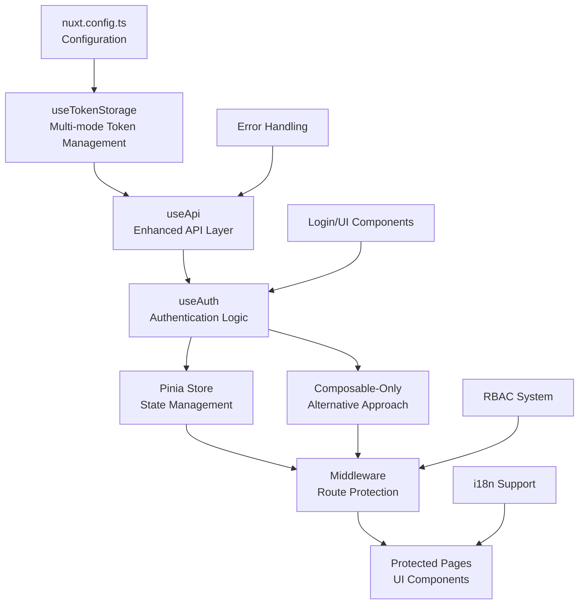

# Complete Nuxt 4 Authentication System Guide

## 🚀 Overview

Welcome to the comprehensive guide for the Enhanced Nuxt 4 Authentication System. This system provides a robust, flexible, and secure authentication solution that supports multiple token management strategies while maintaining backward compatibility with existing Nuxt applications.

## 📋 Table of Contents

- [Quick Start](#quick-start)
- [Architecture Overview](#architecture-overview)
- [Authentication Modes](#authentication-modes)
- [Core Components](#core-components)
- [Implementation Approaches](#implementation-approaches)
- [Security Features](#security-features)
- [Internationalization](#internationalization)
- [Error Handling](#error-handling)
- [Route Protection](#route-protection)
- [API Integration](#api-integration)
- [UI Components](#ui-components)
- [Troubleshooting](#troubleshooting)
- [FAQ](#faq)
- [Related Guides](#related-guides)

## 🚀 Quick Start

### 1. Basic Setup

The authentication system is pre-configured and ready to use. Simply configure your preferred authentication mode:

```typescript
// nuxt.config.ts
export default defineNuxtConfig({
  runtimeConfig: {
    public: {
      authMode: "refresh", // 'access' | 'refresh' | 'cookie'
    },
  },
});
```

### 2. Environment Configuration

```bash
# .env
NUXT_PUBLIC_AUTH_MODE=refresh
```

### 3. Basic Usage

```vue
<template>
  <div>
    <div v-if="isAuthenticated">
      <h1>Welcome, {{ user?.name }}!</h1>
      <button @click="logout">Logout</button>
    </div>
    <div v-else>
      <NuxtLink to="/auth/login">Login</NuxtLink>
    </div>
  </div>
</template>

<script setup>
// Using Pinia Store Approach
const authStore = useAuthStore();
const { isAuthenticated, user } = storeToRefs(authStore);
const { logout } = authStore;

// OR Using Composable-Only Approach
// const { isAuthenticated, user, logout } = useAuth()
</script>
```

## 🏗️ Architecture Overview

### System Architecture



### Design Principles

1. **Strategy Pattern**: Interchangeable authentication modes
2. **Composable-First**: Reusable logic through composables
3. **Type Safety**: Full TypeScript coverage
4. **SSR Compatibility**: Proper server/client state handling
5. **Security First**: Best practices for token management
6. **Backward Compatibility**: Preserves existing functionality

## 🔐 Authentication Modes

The system supports three distinct authentication modes, each optimized for different security requirements and use cases:

### 1. Access Mode (`access`)

- **Best for**: High-security applications, development/testing
- **Token Storage**: Memory only (no persistence)
- **Security Level**: ⭐⭐⭐⭐⭐ (Highest)
- **User Experience**: Users re-login after page refresh
- **Use Case**: Banking apps, admin panels, sensitive data

```typescript
// Configuration
NUXT_PUBLIC_AUTH_MODE = access;

// Usage
const { getAccessToken, isTokenExpired } = useTokenStorage();
```

### 2. Refresh Mode (`refresh`) - **Recommended**

- **Best for**: Most production applications
- **Token Storage**: Access tokens in memory + refresh tokens in localStorage
- **Security Level**: ⭐⭐⭐⭐ (High)
- **User Experience**: Seamless experience with automatic token refresh
- **Use Case**: E-commerce, dashboards, business applications

```typescript
// Configuration
NUXT_PUBLIC_AUTH_MODE = refresh;

// Usage
const { getAccessToken, getRefreshToken, refreshTokens } = useTokenStorage();
```

### 3. Cookie Mode (`cookie`)

- **Best for**: Enterprise applications with strict security requirements
- **Token Storage**: Server-managed httpOnly cookies
- **Security Level**: ⭐⭐⭐⭐⭐ (Highest overall)
- **User Experience**: Transparent to users
- **Use Case**: Enterprise systems, government applications

```typescript
// Configuration
NUXT_PUBLIC_AUTH_MODE = cookie;

// Server-side cookie management required
```

## 🧩 Core Components

### 1. Token Storage (`useTokenStorage`)

The foundation of the authentication system, providing mode-aware token management:

```typescript
const {
  getAccessToken, // Get current access token
  setAccessToken, // Store access token (memory only)
  getRefreshToken, // Get refresh token (refresh mode only)
  setRefreshToken, // Store refresh token (localStorage)
  clear, // Clear all tokens
  getAuthMode, // Get current auth mode
  isTokenExpired, // Check token expiration
} = useTokenStorage();
```

### 2. API Layer (`useApi`)

Enhanced API composable with automatic token management and error handling:

```typescript
const {
  get, // Authenticated GET request
  post, // Authenticated POST request
  put, // Authenticated PUT request
  patch, // Authenticated PATCH request
  delete: del, // Authenticated DELETE request
  publicGet, // Public GET request (no auth)
  publicPost, // Public POST request (no auth)
} = useApi();
```

### 3. Authentication Logic (`useAuth` / Pinia Store)

Two approaches for managing authentication state and logic:

#### Pinia Store Approach

```typescript
const authStore = useAuthStore();
const { isAuthenticated, user, hasPermission } = storeToRefs(authStore);
const { login, logout, refreshUser } = authStore;
```

#### Composable-Only Approach

```typescript
const { isAuthenticated, user, login, logout, hasPermission, hasRole } =
  useAuth();
```

## 🛡️ Security Features

### Token Security

- **Access tokens**: Never persisted to localStorage
- **Refresh tokens**: Encrypted storage (refresh mode)
- **Automatic cleanup**: Tokens cleared on logout/expiry
- **XSS Protection**: Memory-only access token storage

### Session Management

- **Automatic expiry**: Tokens expire based on server configuration
- **Global 401 handling**: Automatic session cleanup on expiry
- **Multi-tab sync**: Logout synchronization across tabs
- **Return URL saving**: Seamless redirect after re-authentication

### Network Security

- **HTTPS enforcement**: Secure token transmission
- **CSRF protection**: Built-in Nuxt CSRF protection
- **Request validation**: Input sanitization and validation
- **Error information**: No sensitive data in error messages

## 🌍 Internationalization

Full Arabic and English support with RTL/LTR layout handling:

### Language Support

- **English (en)**: Left-to-right layout
- **Arabic (ar)**: Right-to-left layout with proper text direction
- **Dynamic switching**: Runtime language switching
- **Fallback messages**: Graceful degradation for missing translations

### Authentication Messages

```json
// English
{
  "auth": {
    "login": {
      "title": "Login",
      "username": "Username",
      "password": "Password",
      "submit": "Sign In"
    },
    "errors": {
      "invalidCredentials": "Invalid username or password",
      "sessionExpired": "Your session has expired, please login again"
    }
  }
}

// Arabic
{
  "auth": {
    "login": {
      "title": "تسجيل الدخول",
      "username": "اسم المستخدم",
      "password": "كلمة المرور",
      "submit": "دخول"
    },
    "errors": {
      "invalidCredentials": "اسم المستخدم أو كلمة المرور غير صحيحة",
      "sessionExpired": "انتهت صلاحية الجلسة، يرجى التسجيل مجدداً"
    }
  }
}
```

## ⚠️ Error Handling

Comprehensive error handling with intelligent fallback messages:

### Error Categories

1. **Network Errors**: Connection issues, timeouts
2. **Authentication Errors**: 401 unauthorized, token expiry
3. **Authorization Errors**: 403 forbidden, insufficient permissions
4. **Validation Errors**: Form validation, input errors
5. **Server Errors**: 500 internal server error
6. **Unknown Errors**: Unexpected errors with fallback messages

### Error Hierarchy

1. **Backend messages**: Always prioritized when available
2. **Network status**: Connection state notifications
3. **Fallback messages**: Arabic/English fallbacks for unknown errors
4. **User feedback**: Non-intrusive snackbar notifications

### Global 401 Handler

```typescript
// Automatic session expiry handling
const sessionExpiredConfig = {
  message: "انتهت صلاحية الجلسة، يرجى التسجيل مجدداً",
  redirectDelay: 2000,
  saveReturnUrl: true,
  clearAuthData: true,
};
```

## 🛡️ Route Protection

### Middleware System

- **auth.ts**: Basic authentication requirement
- **permission.ts**: Role-based access control
- **guest.ts**: Guest-only routes (login, register)

### Page Protection

```vue
<script setup>
// Require authentication
definePageMeta({
  middleware: "auth",
});

// Require specific permission
definePageMeta({
  middleware: "permission",
  permission: "users.view",
});

// Require multiple permissions (all required)
definePageMeta({
  middleware: "permission",
  permissions: ["users.view", "users.edit"],
  permissionMode: "all",
});

// Require any of multiple permissions
definePageMeta({
  middleware: "permission",
  permissions: ["users.view", "admin.access"],
  permissionMode: "any",
});
</script>
```

### Zero Flash Protection

- **Immediate redirects**: No protected content shown to unauthorized users
- **SSR-safe**: Proper server-side authentication checking
- **Home page protection**: Root route requires authentication

## 🌐 API Integration

### Public vs Authenticated Endpoints

```typescript
// Public endpoints (no authentication required)
const publicEndpoints = [
  "/auth/login",
  "/auth/register",
  "/public/*",
  "/health",
  "/contact",
];

// Authenticated API calls
const { data } = await $api.get("/api/users");

// Public API calls
const { data } = await $api.publicGet("/api/public/stats");
```

### Automatic Token Refresh

```typescript
// Automatic refresh flow (refresh mode only)
1. API request with expired access token
2. Receive 401 response
3. Attempt token refresh using refresh token
4. Retry original request with new access token
5. Return data or handle refresh failure
```

## 🎨 UI Components

### Professional Vuetify 3 Components

- **Login Page**: Clean, responsive login form
- **Unauthorized Page**: Professional access denied page
- **Loading States**: Smooth loading indicators
- **Error Messages**: User-friendly error displays

### Design Standards

- **Material Design 3**: Modern Vuetify 3 components
- **Responsive Design**: Mobile-first approach
- **Accessibility**: WCAG 2.1 AA compliance
- **Theme Support**: Dark/light theme compatibility
- **RTL Support**: Proper Arabic layout handling

## 🔧 Troubleshooting

### Common Issues

#### 1. Token Not Found

**Problem**: "Access token not found" error
**Solution**:

- Check if user is logged in
- Verify token storage mode configuration
- Check for token expiry

```typescript
const { isTokenExpired, getAccessToken } = useTokenStorage();
if (isTokenExpired() || !getAccessToken()) {
  // Redirect to login or refresh token
}
```

#### 2. 401 Errors on API Calls

**Problem**: Receiving 401 unauthorized errors
**Solution**:

- Verify token is being sent in headers
- Check token expiration
- Ensure endpoint requires authentication

```typescript
// Debug token headers
const headers = getAuthHeaders();
console.log("Auth headers:", headers);
```

#### 3. Refresh Token Issues

**Problem**: Refresh token not working
**Solution**:

- Verify refresh mode is enabled
- Check refresh token in localStorage
- Ensure refresh endpoint is configured

```typescript
const { getRefreshToken, getAuthMode } = useTokenStorage();
console.log("Auth mode:", getAuthMode());
console.log("Refresh token:", getRefreshToken());
```

#### 4. SSR Hydration Issues

**Problem**: Authentication state mismatch between server and client
**Solution**:

- Use `useState` for SSR-safe state
- Initialize auth state properly
- Handle client-only operations

```typescript
// SSR-safe authentication check
const isAuthenticated = useState("auth.isAuthenticated", () => false);
```

#### 5. Permission Denied Errors

**Problem**: User has insufficient permissions
**Solution**:

- Check user permissions and roles
- Verify middleware configuration
- Update user permissions on server

```typescript
const { hasPermission, user } = useAuth();
console.log("User permissions:", user.value?.permissions);
console.log("Has permission:", hasPermission("users.view"));
```

### Debug Mode

Enable debug logging for troubleshooting:

```typescript
// Enable debug mode in development
if (process.dev) {
  console.log("Auth Debug Mode Enabled");
  // Add debug logging to composables
}
```

## ❓ FAQ

### General Questions

**Q: Which authentication mode should I use?**
A: For most applications, use `refresh` mode. It provides the best balance of security and user experience. Use `access` mode for high-security applications where users can re-login frequently. Use `cookie` mode for enterprise applications with strict security requirements.

**Q: Can I switch between Pinia and composable-only approaches?**
A: Yes, both approaches provide identical APIs. You can migrate between them with minimal code changes.

**Q: Is the system compatible with existing Nuxt applications?**
A: Yes, the system is designed for backward compatibility. Existing authentication code will continue to work while you gradually adopt new features.

### Technical Questions

**Q: How do I handle token refresh failures?**
A: The system automatically handles refresh failures by clearing authentication state and redirecting to login. You can customize this behavior in the error handler.

**Q: Can I use custom token storage?**
A: Yes, you can extend the `useTokenStorage` composable to implement custom storage strategies while maintaining the same API.

**Q: How do I add new permissions?**
A: Permissions are managed server-side. Update your user's permissions on the server, and the client will automatically receive them on next login or user data refresh.

### Security Questions

**Q: Are tokens secure in localStorage?**
A: Access tokens are never stored in localStorage for security. Only refresh tokens are stored in localStorage in refresh mode, and they should be encrypted server-side.

**Q: How do I protect against XSS attacks?**
A: The system stores access tokens in memory only, uses input sanitization, and supports CSP headers. For maximum security, use cookie mode with httpOnly cookies.

**Q: What happens if a user's session expires?**
A: The system automatically detects session expiry, shows a user-friendly message, clears authentication data, and redirects to login while saving the return URL.

## 📚 Related Guides

For detailed information on specific topics, refer to these specialized guides:

- **[Token Storage Guide](./token-storage-guide.md)**: Detailed token management and security
- **[Authentication Approaches Guide](./authentication-approaches-guide.md)**: Pinia vs Composable comparison
- **[API Usage Guide](./api-usage-guide.md)**: API integration and error handling
- **[RBAC Guide](./rbac-guide.md)**: Role-based access control
- **[UI Components Guide](./ui-components-guide.md)**: Vuetify components and theming
- **[Error Handling Guide](./error-handling-guide.md)**: Comprehensive error management
- **[i18n Auth Guide](./i18n-auth-guide.md)**: Internationalization and RTL support

## 🚀 Next Steps

1. **Choose your authentication mode** based on security requirements
2. **Select your approach** (Pinia store vs composable-only)
3. **Configure your environment** variables
4. **Implement route protection** using middleware
5. **Customize UI components** to match your design
6. **Test your implementation** with different scenarios
7. **Deploy with confidence** knowing your authentication is secure

---

**Need Help?** Check the troubleshooting section above or refer to the specialized guides for detailed implementation examples.
