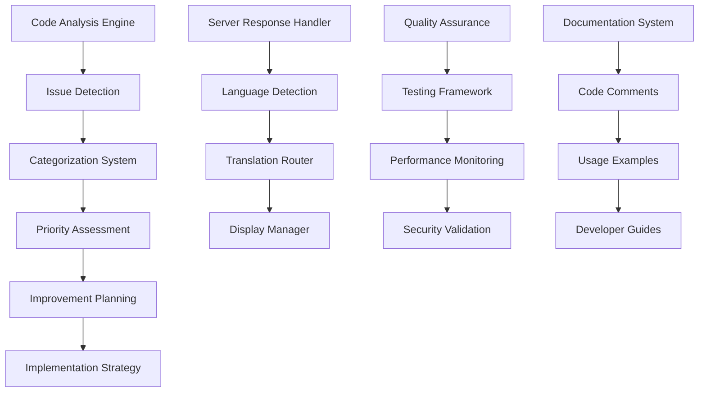

# Design Document

## Overview

This design document outlines the comprehensive analysis and improvement strategy for the existing Nuxt 4 authentication system. The design focuses on identifying and resolving code quality issues, implementing missing features, and creating a robust foundation for future projects.

## Architecture

### Analysis and Improvement Architecture



### Current System Analysis

Based on the codebase review, the current system has:

**Strengths:**

- Comprehensive authentication system with multiple modes
- Excellent internationalization support
- Advanced error handling framework
- Professional UI components with Vuetify 3
- Robust token management system

**Identified Issues:**

- Some code duplication in error handling patterns
- Inconsistent import patterns across files
- Missing server response language detection
- Incomplete testing coverage
- Some performance optimization opportunities
- Documentation gaps in certain areas

## Components and Interfaces

### 1. Code Analysis and Quality System

#### CodeAnalyzer Interface

```typescript
interface CodeAnalyzer {
  analyzeDuplication(): DuplicationReport;
  checkConsistency(): ConsistencyReport;
  validateTypes(): TypeSafetyReport;
  assessPerformance(): PerformanceReport;
  auditSecurity(): SecurityReport;
}

interface IssueReport {
  category:
    | "duplication"
    | "consistency"
    | "performance"
    | "security"
    | "types";
  severity: "low" | "medium" | "high" | "critical";
  location: string;
  description: string;
  suggestion: string;
  autoFixable: boolean;
}
```

#### Quality Metrics Dashboard

```typescript
interface QualityMetrics {
  codeQuality: {
    duplicationPercentage: number;
    typesCoverage: number;
    testCoverage: number;
    maintainabilityIndex: number;
  };
  performance: {
    bundleSize: number;
    loadTime: number;
    renderTime: number;
    memoryUsage: number;
  };
  security: {
    vulnerabilities: SecurityIssue[];
    complianceScore: number;
    auditResults: AuditResult[];
  };
}
```

### 2. Enhanced Server Response Translation System

#### Language Detection Engine

```typescript
interface LanguageDetector {
  detectLanguage(text: string): "ar" | "en" | "mixed" | "unknown";
  extractLanguageHints(response: ApiResponse): LanguageHint[];
  prioritizeLanguage(serverLang: string, userLang: string): string;
}

interface ServerResponseTranslator {
  processResponse(response: ApiResponse): TranslatedResponse;
  handleMixedLanguage(text: string): ProcessedText;
  fallbackToClientTranslation(key: string): string;
}
```

#### Smart Translation Router

```typescript
interface TranslationRouter {
  route(message: string, context: TranslationContext): string;
  detectServerLanguage(response: any): string | null;
  applyLanguagePreference(message: string, userLang: string): string;
  handleFallbacks(message: string, fallbacks: string[]): string;
}
```

### 3. Unified Error Handling Enhancement

#### Enhanced Error Handler

```typescript
interface EnhancedErrorHandler {
  categorizeError(error: any): ErrorCategory;
  generateContextualMessage(error: any, context: string): string;
  suggestRecoveryActions(error: any): RecoveryAction[];
  logErrorWithContext(error: any, context: ErrorContext): void;
}

interface ErrorRecovery {
  canRecover(error: any): boolean;
  attemptRecovery(error: any): Promise<boolean>;
  getRecoveryInstructions(error: any): RecoveryInstruction[];
}
```

### 4. Performance Optimization System

#### Performance Monitor

```typescript
interface PerformanceMonitor {
  trackPageLoad(route: string): void;
  measureComponentRender(component: string): void;
  monitorApiCalls(endpoint: string): void;
  generatePerformanceReport(): PerformanceReport;
}

interface OptimizationEngine {
  identifyBottlenecks(): Bottleneck[];
  suggestOptimizations(): Optimization[];
  implementAutoOptimizations(): void;
  measureImprovements(): ImprovementMetrics;
}
```

### 5. Security Hardening Framework

#### Security Auditor

```typescript
interface SecurityAuditor {
  auditTokenSecurity(): SecurityReport;
  validateInputSanitization(): ValidationReport;
  checkPermissionSystem(): PermissionReport;
  scanForVulnerabilities(): VulnerabilityReport;
}

interface SecurityEnforcer {
  enforceTokenSecurity(): void;
  sanitizeInputs(data: any): any;
  validatePermissions(user: User, resource: string): boolean;
  logSecurityEvents(event: SecurityEvent): void;
}
```

## Data Models

### Analysis Results Models

```typescript
interface AnalysisResult {
  id: string;
  timestamp: Date;
  category: AnalysisCategory;
  issues: Issue[];
  metrics: QualityMetrics;
  recommendations: Recommendation[];
}

interface Issue {
  id: string;
  type: IssueType;
  severity: Severity;
  file: string;
  line?: number;
  description: string;
  solution: string;
  autoFixable: boolean;
  estimatedEffort: number;
}

interface Recommendation {
  id: string;
  priority: Priority;
  category: string;
  title: string;
  description: string;
  implementation: string;
  benefits: string[];
  risks: string[];
}
```

### Enhanced Translation Models

```typescript
interface TranslationContext {
  endpoint?: string;
  operation?: string;
  userLanguage: string;
  serverLanguage?: string;
  fallbackLanguage: string;
}

interface TranslatedResponse {
  originalMessage: string;
  translatedMessage: string;
  detectedLanguage: string;
  confidence: number;
  fallbackUsed: boolean;
}

interface LanguageHint {
  source: "header" | "content" | "metadata";
  language: string;
  confidence: number;
}
```

### Performance Models

```typescript
interface PerformanceMetrics {
  loadTime: number;
  renderTime: number;
  bundleSize: number;
  memoryUsage: number;
  networkRequests: number;
  cacheHitRate: number;
}

interface Bottleneck {
  type: "component" | "api" | "bundle" | "memory";
  location: string;
  impact: number;
  suggestion: string;
  priority: Priority;
}
```

## Error Handling

### Enhanced Error Categorization

```typescript
enum ErrorCategory {
  NETWORK = "network",
  SERVER = "server",
  VALIDATION = "validation",
  AUTHENTICATION = "authentication",
  AUTHORIZATION = "authorization",
  BUSINESS_LOGIC = "business_logic",
  SYSTEM = "system",
  USER_INPUT = "user_input",
}

interface ErrorContext {
  operation: string;
  endpoint?: string;
  userAction: string;
  timestamp: Date;
  userAgent: string;
  sessionId: string;
}
```

### Smart Error Recovery

```typescript
interface RecoveryStrategy {
  canHandle(error: any): boolean;
  attempt(error: any, context: ErrorContext): Promise<RecoveryResult>;
  getInstructions(error: any): UserInstruction[];
}

interface RecoveryResult {
  success: boolean;
  message: string;
  nextAction?: string;
  retryable: boolean;
}
```

## Testing Strategy

### Comprehensive Testing Framework

#### Unit Testing

- **Composables Testing**: Test all authentication composables with mock data
- **Store Testing**: Verify Pinia store actions and getters
- **Utility Testing**: Test all helper functions and utilities
- **Component Testing**: Test UI components in isolation

#### Integration Testing

- **Authentication Flow**: Test complete login/logout flows
- **API Integration**: Test API calls with different scenarios
- **Error Handling**: Test error scenarios and recovery
- **Translation System**: Test language switching and server response handling

#### End-to-End Testing

- **User Journeys**: Test complete user workflows
- **Cross-browser Testing**: Ensure compatibility across browsers
- **Performance Testing**: Test load times and responsiveness
- **Accessibility Testing**: Verify WCAG compliance

### Quality Assurance Metrics

```typescript
interface QualityGates {
  codeQuality: {
    minTestCoverage: 85;
    maxDuplication: 5;
    maxComplexity: 10;
    minMaintainability: 70;
  };
  performance: {
    maxBundleSize: "500KB";
    maxLoadTime: "2s";
    maxRenderTime: "100ms";
    minLighthouseScore: 90;
  };
  security: {
    maxVulnerabilities: 0;
    minSecurityScore: 95;
    requiredAudits: ["auth", "xss", "csrf"];
  };
}
```

## Implementation Phases

### Phase 1: Analysis and Assessment (Week 1)

1. **Code Analysis Engine**: Implement automated code analysis tools
2. **Issue Detection**: Identify all duplications, inconsistencies, and issues
3. **Metrics Collection**: Gather baseline performance and quality metrics
4. **Priority Assessment**: Categorize and prioritize identified issues

### Phase 2: Core Improvements (Week 2-3)

1. **Code Deduplication**: Eliminate duplicate code and consolidate functionality
2. **Consistency Fixes**: Standardize naming conventions and patterns
3. **Type Safety**: Enhance TypeScript coverage and fix type issues
4. **Performance Optimization**: Implement identified performance improvements

### Phase 3: Feature Enhancements (Week 4-5)

1. **Server Response Translation**: Implement intelligent language detection
2. **Enhanced Error Handling**: Upgrade error handling with contextual messages
3. **Security Hardening**: Implement additional security measures
4. **Missing Features**: Add identified missing functionality

### Phase 4: Quality Assurance (Week 6)

1. **Testing Implementation**: Add comprehensive test coverage
2. **Documentation**: Complete all documentation gaps
3. **Performance Validation**: Verify performance improvements
4. **Security Audit**: Conduct final security review

### Phase 5: Integration and Deployment (Week 7)

1. **Integration Testing**: Test all improvements together
2. **Migration Guide**: Create upgrade path for existing projects
3. **Deployment Preparation**: Prepare for production deployment
4. **Monitoring Setup**: Implement ongoing quality monitoring

## Security Considerations

### Enhanced Security Measures

1. **Token Security**

   - Implement secure token rotation
   - Add token fingerprinting
   - Enhance token validation

2. **Input Validation**

   - Comprehensive input sanitization
   - XSS prevention measures
   - SQL injection protection

3. **Permission System**

   - Fine-grained access control
   - Role-based permissions
   - Dynamic permission evaluation

4. **Audit Logging**
   - Security event logging
   - User action tracking
   - Compliance reporting

## Performance Optimization Strategy

### Optimization Areas

1. **Bundle Optimization**

   - Code splitting improvements
   - Tree shaking enhancements
   - Dynamic imports optimization

2. **Runtime Performance**

   - Component rendering optimization
   - Memory usage reduction
   - API call optimization

3. **Caching Strategy**

   - Intelligent caching implementation
   - Cache invalidation strategies
   - Offline capability enhancement

4. **Loading Performance**
   - Progressive loading implementation
   - Image optimization
   - Critical resource prioritization

## Monitoring and Maintenance

### Continuous Quality Monitoring

```typescript
interface QualityMonitor {
  trackCodeQuality(): void;
  monitorPerformance(): void;
  auditSecurity(): void;
  generateReports(): QualityReport;
}

interface MaintenanceSchedule {
  daily: DailyCheck[];
  weekly: WeeklyCheck[];
  monthly: MonthlyCheck[];
  quarterly: QuarterlyCheck[];
}
```

### Automated Quality Gates

1. **Pre-commit Hooks**: Code quality checks before commits
2. **CI/CD Pipeline**: Automated testing and quality validation
3. **Performance Monitoring**: Continuous performance tracking
4. **Security Scanning**: Regular security vulnerability scans

This design provides a comprehensive framework for analyzing and improving the existing system while maintaining backward compatibility and ensuring a smooth transition to the enhanced version.
