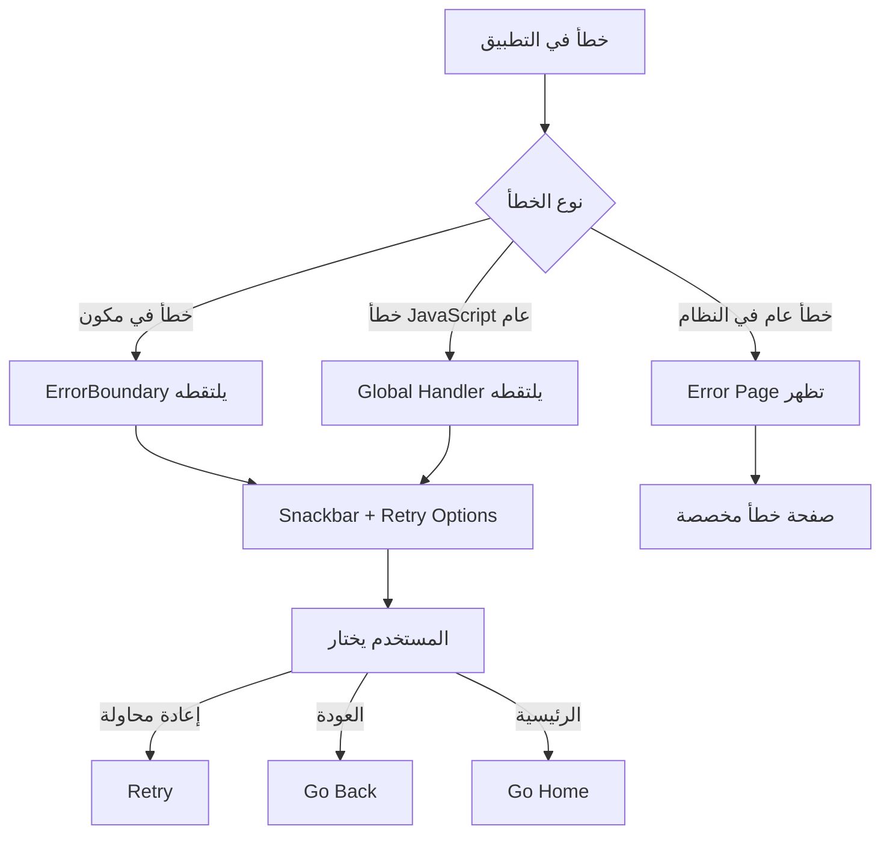

# دليل معالجة الأخطاء المبسط - Nuxt 3

## نظرة عامة

نظام معالجة أخطاء **بسيط وفعال** يركز على **سهولة الاستخدام** مع **التغطية الشاملة**. 
تم إزالة الميزات المعقدة والتركيز على الأساسيات.

## المكونات المتاحة

### 1. ErrorBoundary.vue
مكون مخصص لالتقاط الأخطاء في المكونات الفرعية.

### 2. error.vue
صفحة مخصصة لعرض الأخطاء العامة في التطبيق.

### 3. useErrorHandler.ts
Composable مبسط لمعالجة الأخطاء بشكل مركزي.

### 4. Global Error Handler Plugin
Plugin يلتقط جميع أخطاء JavaScript والـ Promise غير المعالجة.

## كيفية الاستخدام

### 1. ErrorBoundary (مبسط)

```vue
<template>
  <ErrorBoundary @error="handleError" @retry="handleRetry">
    <YourComponent />
  </ErrorBoundary>
</template>

<script setup>
const handleError = (error) => {
  console.log('Error caught:', error)
}

const handleRetry = () => {
  console.log('Retry attempted')
}
</script>
```

#### خيارات بسيطة:

```vue
<ErrorBoundary 
  :retry-count="2"        // عدد مرات إعادة المحاولة (افتراضي: 2)
  :show-details="true"    // إظهار تفاصيل الخطأ في التطوير
  :auto-hide="false"      // إخفاء تلقائي بعد 10 ثوانِ
  @error="handleError"    // callback للخطأ
  @retry="handleRetry"    // callback لإعادة المحاولة
>
  <YourComponent />
</ErrorBoundary>
```

### 2. استخدام NuxtErrorBoundary

```vue
<template>
  <NuxtErrorBoundary @error="handleError">
    <YourComponent />
    
    <template #error="{ error, clearError }">
      <v-alert type="error" variant="tonal">
        <div class="text-h6">حدث خطأ</div>
        <div>{{ error?.message }}</div>
        <v-btn @click="clearError">إعادة المحاولة</v-btn>
      </v-alert>
    </template>
  </NuxtErrorBoundary>
</template>
```

### 3. useErrorHandler (مبسط)

```vue
<script setup>
const { handleError, handleApiError, handleAsyncError } = useErrorHandler()

// معالجة خطأ بسيط
const handleSimpleError = () => {
  handleError('حدث خطأ في العملية')
}

// معالجة خطأ من API
const fetchData = async () => {
  try {
    const data = await $fetch('/api/users')
    return data
  } catch (error) {
    handleApiError(error, 'fetching users')
  }
}

// معالجة خطأ مع خيارات
const processData = async () => {
  try {
    return await $fetch('/api/process')
  } catch (error) {
    handleError(error, {
      showSnackbar: true,
      logToConsole: true,
      redirect: '/dashboard' // إعادة توجيه عند الخطأ
    })
  }
}
</script>
```

### 4. إنشاء أخطاء مخصصة

```javascript
// في composables أو pages
const { createCustomError } = useErrorHandler()

// إنشاء خطأ مخصص
const customError = createCustomError(
  'فشل في حفظ البيانات',
  500,
  'save-user-data'
)

// رمي الخطأ
throw customError
```

## أنواع الأخطاء

### 1. أخطاء الشبكة
```javascript
const { isNetworkError } = useErrorHandler()

if (isNetworkError(error)) {
  // معالجة خطأ الشبكة
  showNetworkError()
}
```

### 2. أخطاء المصادقة
```javascript
const { isAuthError } = useErrorHandler()

if (isAuthError(error)) {
  // إعادة توجيه لصفحة تسجيل الدخول
  navigateTo('/login')
}
```

### 3. أخطاء التحقق
```javascript
const { isValidationError } = useErrorHandler()

if (isValidationError(error)) {
  // عرض رسائل التحقق
  showValidationErrors(error.details)
}
```

## أفضل الممارسات

### 1. تغليف المكونات الحساسة

```vue
<template>
  <div>
    <!-- مكونات مستقرة -->
    <Header />
    <Sidebar />
    
    <!-- مكونات قد تسبب أخطاء -->
    <ErrorBoundary>
      <DataTable :data="users" />
    </ErrorBoundary>
    
    <ErrorBoundary>
      <ChartComponent :data="analytics" />
    </ErrorBoundary>
  </div>
</template>
```

### 2. معالجة أخطاء API

```javascript
// في composables/useApi.ts
export const useApi = () => {
  const { handleApiError, handleErrorWithRetry } = useErrorHandler()
  
  const fetchUsers = async () => {
    return await handleErrorWithRetry(
      async () => {
        const response = await $fetch('/api/users')
        return response
      },
      3, // max retries
      1000 // delay
    )
  }
  
  const createUser = async (userData) => {
    try {
      const response = await $fetch('/api/users', {
        method: 'POST',
        body: userData
      })
      return response
    } catch (error) {
      handleApiError(error, 'creating user')
      throw error
    }
  }
  
  return {
    fetchUsers,
    createUser
  }
}
```

### 3. معالجة أخطاء العمليات غير المتزامنة

```javascript
// في pages/users/index.vue
const { handleAsyncError } = useErrorHandler()

const loadUsers = async () => {
  const users = await handleAsyncError(
    async () => {
      const response = await $fetch('/api/users')
      return response.data
    },
    [], // fallback: empty array
    {
      showSnackbar: true,
      logToConsole: true
    }
  )
  
  if (users) {
    usersList.value = users
  }
}
```

## النظام العام (Global Error Boundary)

### التكوين التلقائي

النظام يعمل تلقائياً بدون تكوين إضافي:

1. **Global Error Boundary في app.vue** - يلتقط أخطاء المكونات
2. **Global Error Handler Plugin** - يلتقط أخطاء JavaScript العامة
3. **Error Page** - صفحة مخصصة للأخطاء العامة
4. **Snackbar Integration** - عرض الأخطاء في snackbar

### كيف يعمل النظام



## الاختبار

### صفحة الاختبار
يمكنك زيارة `/test-error-boundary` لاختبار جميع أنواع الأخطاء.

### أمثلة الاختبار

```javascript
// اختبار ErrorBoundary
const testErrorBoundary = () => {
  throw new Error('خطأ تجريبي')
}

// اختبار أخطاء API
const testApiError = async () => {
  await $fetch('/api/non-existent-endpoint')
}

// اختبار أخطاء غير متزامنة
const testAsyncError = async () => {
  await new Promise((_, reject) => {
    setTimeout(() => reject(new Error('خطأ غير متزامن')), 1000)
  })
}
```

## الفرق بين المكونات

| المكون | الاستخدام | المميزات |
|--------|-----------|----------|
| **ErrorBoundary** | أخطاء المكونات | - إعادة المحاولة التلقائية<br>- واجهة مخصصة<br>- خيارات متقدمة |
| **NuxtErrorBoundary** | أخطاء Nuxt | - مدمج مع Nuxt<br>- بسيط وسريع<br>- slot مخصص |
| **error.vue** | أخطاء عامة | - صفحة خطأ مخصصة<br>- تصميم جميل<br>- خيارات متعددة |

## الخلاصة

### نظام معالجة أخطاء مبسط وفعال:

✅ **البساطة القصوى**: واجهات بسيطة وواضحة  
✅ **تغطية شاملة**: جميع أنواع الأخطاء محطوة  
✅ **عمل تلقائي**: لا يحتاج تكوين معقد  
✅ **تجربة مستخدم ممتازة**: واجهات جميلة مع خيارات واضحة  
✅ **Global Error Boundary**: حماية شاملة للتطبيق  

### الاستخدام الأساسي:

```vue
<!-- لحماية مكون معين -->
<ErrorBoundary>
  <YourComponent />
</ErrorBoundary>

<!-- لمعالجة خطأ يدوياً -->
<script setup>
const { handleError } = useErrorHandler()

try {
  // عملية قد تفشل
} catch (error) {
  handleError(error)
}
</script>
```

النظام يعمل **تلقائياً** ويحمي تطبيقك من الانهيار! 🛡️ 