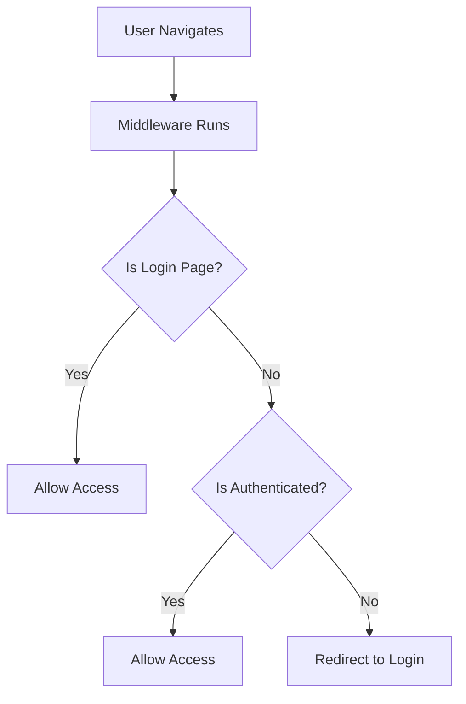

# Authentication System Documentation

## Overview

This Nuxt 3 authentication system provides a complete client-side authentication solution using Pinia for state management, route middleware for protection, and plugins for initialization. It supports token-based authentication with localStorage persistence, multi-tab synchronization, and internationalization.

**Key Features:**
- Token-based authentication with localStorage persistence
- Automatic route protection with middleware
- Multi-tab authentication synchronization
- Internationalization support (i18n)
- Permission-based access control
- Clean separation of concerns (store, plugin, middleware)

## Folder and File Structure

```
├── stores/
│   └── auth.ts              # Pinia store for auth state management
├── plugins/
│   └── auth.ts              # App initialization and global event listeners
├── middleware/
│   └── auth.ts              # Route protection middleware
└── nuxt.config.ts           # Plugin registration
```

### File Roles

| File | Purpose | When It Runs |
|------|---------|--------------|
| `stores/auth.ts` | Central auth state, login/logout logic | On demand (user actions) |
| `plugins/auth.ts` | App initialization, global listeners | App startup (client-side) |
| `middleware/auth.ts` | Route protection | Every navigation |

## How It Works

### 1. Application Startup Flow

```mermaid
graph TD
    A[App Starts] --> B[Plugin Loads]
    B --> C[Store.initAuth()]
    C --> D[Check localStorage]
    D --> E{Token Exists?}
    E -->|Yes| F[Restore Auth State]
    E -->|No| G[User Not Authenticated]
    F --> H[App Ready]
    G --> H
```

### 2. Route Protection Flow



### 3. Authentication State Management

The system uses a three-layer approach:

1. **Store Layer** (`stores/auth.ts`): Manages reactive state
2. **Plugin Layer** (`plugins/auth.ts`): Handles app-level concerns
3. **Middleware Layer** (`middleware/auth.ts`): Protects routes

## Setup Instructions

### 1. Install Dependencies

```bash
npm install @pinia/nuxt
```

### 2. Configure Nuxt

```typescript
// nuxt.config.ts
export default defineNuxtConfig({
  modules: [
    '@pinia/nuxt',
    '@nuxtjs/i18n'
  ],
  plugins: [
    '~/plugins/auth'
  ]
})
```

### 3. Create Required Files

Copy the three auth files to their respective directories:

- `stores/auth.ts` - Pinia store
- `plugins/auth.ts` - Plugin initialization  
- `middleware/auth.ts` - Route middleware

### 4. Configure Axios (Optional)

If using axios for API calls, ensure it's configured in your Nuxt app:

```typescript
// plugins/axios.js
export default defineNuxtPlugin(() => {
  const config = useRuntimeConfig()
  
  return {
    provide: {
      axios: $fetch.create({
        baseURL: config.public.apiBaseUrl
      })
    }
  }
})
```

## Usage Instructions

### Basic Authentication in Pages

```vue
<template>
  <div>
    <div v-if="authStore.isAuthenticated">
      Welcome, {{ authStore.currentUser?.name }}!
      <button @click="handleLogout">Logout</button>
    </div>
    <div v-else>
      <LoginForm />
    </div>
  </div>
</template>

<script setup lang="ts">
const authStore = useAuthStore()

const handleLogout = () => {
  authStore.logout()
}
</script>
```

### Login Form Implementation

```vue
<template>
  <form @submit.prevent="handleLogin">
    <input v-model="username" type="text" placeholder="Username" />
    <input v-model="password" type="password" placeholder="Password" />
    <button type="submit" :disabled="authStore.loading">
      {{ authStore.loading ? 'Logging in...' : 'Login' }}
    </button>
    <div v-if="authStore.error" class="error">
      {{ authStore.error }}
    </div>
  </form>
</template>

<script setup lang="ts">
const authStore = useAuthStore()
const router = useRouter()

const username = ref('')
const password = ref('')

const handleLogin = async () => {
  try {
    await authStore.login(username.value, password.value)
    await router.push('/dashboard')
  } catch (error) {
    // Error is handled by the store
  }
}
</script>
```

### Route Protection

Apply middleware to protected pages:

```vue
<!-- pages/dashboard.vue -->
<script setup lang="ts">
definePageMeta({
  middleware: 'auth'
})

const authStore = useAuthStore()
</script>
```

Or protect all routes in a directory:

```typescript
// middleware/auth.global.ts (optional)
export default defineNuxtRouteMiddleware((to) => {
  // Global auth check for all routes
})
```

### Permission-Based Access

```vue
<template>
  <div>
    <div v-if="authStore.hasPermission('admin')">
      Admin Panel
    </div>
    <div v-if="authStore.hasPermission('user')">
      User Dashboard
    </div>
  </div>
</template>

<script setup lang="ts">
const authStore = useAuthStore()
</script>
```

### Store Usage in Composables

```typescript
// composables/useAuth.ts
export const useAuth = () => {
  const authStore = useAuthStore()
  
  const isAdmin = computed(() => 
    authStore.hasPermission('admin')
  )
  
  const canEdit = computed(() => 
    authStore.hasPermission('edit')
  )
  
  return {
    isAdmin,
    canEdit,
    user: authStore.currentUser,
    isAuthenticated: authStore.isAuthenticated
  }
}
```

## API Integration

### Expected API Response Format

```typescript
// Login API response
interface LoginResponse {
  token: string
  user: {
    id: number
    name: string
    email: string
    permissions: string[]
  }
}
```

### Customizing API Endpoints

Modify the login action in `stores/auth.ts`:

```typescript
async login(username: string, password: string) {
  // ... existing code ...
  
  const response = await $axios.post('/api/v1/auth/login', {
    username,
    password
  })
  
  // ... rest of the code ...
}
```

## Extending the System

### Adding Role-Based Access Control

```typescript
// stores/auth.ts - Add to getters
getters: {
  // ... existing getters ...
  
  hasRole: (state) => (role: string) => {
    return state.user?.roles?.includes(role) || false
  },
  
  isAdmin: (state) => {
    return state.user?.roles?.includes('admin') || false
  }
}
```

### Adding Token Refresh

```typescript
// stores/auth.ts - Add new action
actions: {
  // ... existing actions ...
  
  async refreshToken() {
    try {
      const { $axios } = useNuxtApp()
      const response = await $axios.post('/auth/refresh', {
        token: this.token
      })
      
      this.token = response.data.token
      
      if (process.client) {
        localStorage.setItem('auth_token', response.data.token)
      }
    } catch (error) {
      this.clearAuth()
      throw error
    }
  }
}
```

### Adding Auto-Logout on Inactivity

```typescript
// plugins/auth.ts - Add to plugin
export default defineNuxtPlugin((nuxtApp) => {
  const authStore = useAuthStore()
  
  // ... existing code ...
  
  // Auto-logout after 30 minutes of inactivity
  let inactivityTimer: NodeJS.Timeout
  
  const resetInactivityTimer = () => {
    if (inactivityTimer) clearTimeout(inactivityTimer)
    
    if (authStore.isAuthenticated) {
      inactivityTimer = setTimeout(() => {
        authStore.logout()
      }, 30 * 60 * 1000) // 30 minutes
    }
  }
  
  // Reset timer on user activity
  const events = ['mousedown', 'mousemove', 'keypress', 'scroll', 'touchstart']
  events.forEach(event => {
    document.addEventListener(event, resetInactivityTimer, true)
  })
  
  resetInactivityTimer()
})
```

### Adding Remember Me Functionality

```typescript
// stores/auth.ts - Modify login action
async login(username: string, password: string, rememberMe = false) {
  // ... existing login logic ...
  
  if (process.client) {
    localStorage.setItem('auth_token', response.data.token)
    localStorage.setItem('auth_user', JSON.stringify(response.data.user))
    
    if (rememberMe) {
      localStorage.setItem('remember_me', 'true')
    }
  }
}
```

## Troubleshooting

### Common Issues

1. **Token not persisting**: Ensure `process.client` check is present
2. **Middleware not working**: Verify plugin is registered in `nuxt.config.ts`
3. **i18n redirects failing**: Check locale configuration in Nuxt config

### Debug Mode

Add debug logging to the store:

```typescript
// stores/auth.ts
actions: {
  initAuth() {
    if (process.client) {
      console.log('Initializing auth...')
      const token = localStorage.getItem('auth_token')
      console.log('Token found:', !!token)
      // ... rest of the code
    }
  }
}
```

## Best Practices

1. **Always check `process.client`** before accessing localStorage
2. **Use reactive getters** for computed authentication state
3. **Handle errors gracefully** in login/logout flows
4. **Implement proper loading states** for better UX
5. **Use TypeScript interfaces** for user and auth data
6. **Test authentication flows** across different scenarios

## Security Considerations

- Tokens are stored in localStorage (consider httpOnly cookies for production)
- Implement token expiration handling
- Add CSRF protection for login requests
- Consider implementing rate limiting on login attempts
- Use HTTPS in production environments 